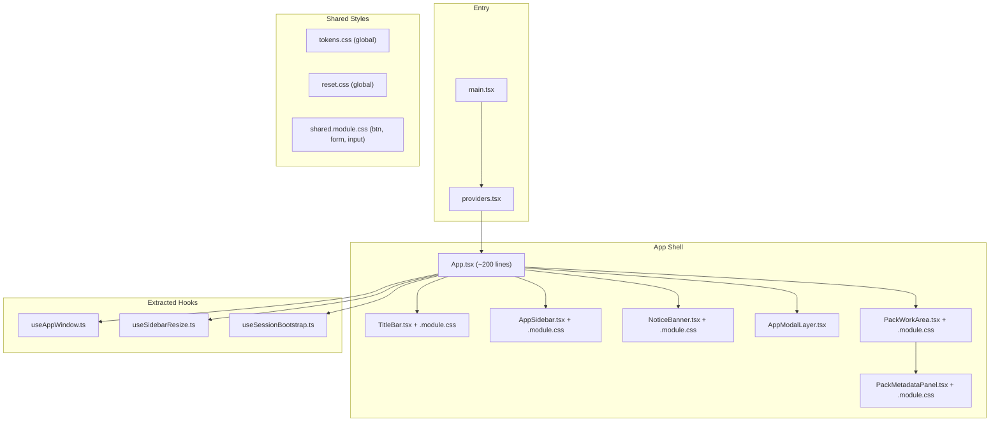

# Frontend Refactoring Plan

## Current State

- [App.tsx](src/app/App.tsx): 1012 lines, 1 component, ~25 inner functions, 11 categories of responsibility
- [styles.css](src/app/styles.css): 2901 lines, single global file, no CSS Modules
- Feature components already organized in `src/features/` but each uses global CSS classes
- Shared infrastructure: [tokens.css](src/shared/styles/tokens.css), [reset.css](src/shared/styles/reset.css), [shellStore.ts](src/shared/stores/shellStore.ts)

## Target Architecture

After refactoring, `App.tsx` reduces to ~200 lines of pure composition/orchestration.

## State Management Strategy

**Principle: state follows component extraction, not centralized expansion.**

- `metaExpanded / metaEditing / metaDraft / metaSaving` → local state in `PackMetadataPanel`
- `editingCardId / isCreatingCard / activeTab` → local state in `PackWorkArea`
- `maximized / shellReady / sidebarWidth` → encapsulated in `useAppWindow` + `useSidebarResize`
- `loading / error` → encapsulated in `useSessionBootstrap`
- `notice` → stays in `App`, passed as callback to children
- `config / currentWorkspace` → stays in `App`, passed via props (unchanged pattern)
- Zustand `shellStore` → no scope change, keeps workspace/pack/modal/dialog

## CSS Modules Migration Strategy

**Global styles that remain global:**
- `tokens.css` — design tokens (CSS custom properties)
- `reset.css` — base reset
- `body.is-resizing-sidebar` — document-level cursor override

**New shared module:**
- `src/shared/styles/shared.module.css` — extract reusable patterns: `.btn`, `.primary-button`, `.ghost-button`, `.danger-button`, `.meta-edit-input`, focus-ring utilities, form layout. These are referenced across multiple features.

**Per-component modules:**
- Each extracted component gets a co-located `.module.css` file
- Class names in JSX change from `className="titlebar"` to `className={styles.titlebar}`
- Composition via `composes:` or multiple class joins where needed

## PR Sequence (incremental, each independently shippable)

### PR1: CSS infrastructure + shared module extraction

**Scope:** No component extraction yet. Lay CSS Modules groundwork.

1. Create `src/shared/styles/shared.module.css` — extract shared button/form/input styles (~150 lines) from `styles.css`
2. Verify Vite CSS Modules support works (already built-in, no config needed)
3. Pick **one small feature** (e.g. `AppDialog.tsx`, 111 lines) and convert it to CSS Modules as proof-of-concept
4. Remove corresponding sections from `styles.css`

**Validates:** CSS Modules workflow, import pattern, no visual regression.

### PR2: Extract shell components (TitleBar, AppSidebar, NoticeBanner)

**Scope:** Biggest visual reduction of `App.tsx`.

1. Extract `TitleBar.tsx` (lines 546-581 of App.tsx) + `TitleBar.module.css` (titlebar/window-controls styles, ~60 lines CSS)
2. Extract `AppSidebar.tsx` (lines 583-687) + `AppSidebar.module.css` (sidebar/pack-list styles, ~220 lines CSS)
3. Extract `NoticeBanner.tsx` (lines 690-698) + inline or tiny module
4. Wire into `App.tsx` with props/callbacks

**App.tsx reduction:** ~200 lines of JSX removed.

### PR3: Extract PackMetadataPanel

**Scope:** The single largest chunk (lines 713-930, ~220 lines JSX).

1. Create `src/features/pack/PackMetadataPanel.tsx` + `.module.css`
2. Move `metaExpanded / metaEditing / metaDraft / metaSaving` state into this component
3. Move `handleStartEditMeta / handleCancelEditMeta / handleSavePackMetadata / handleDeletePack` into this component
4. Props: `packId`, `metadata`, `config`, `onMetadataUpdated`, `onPackDeleted`, `onNotice`

**App.tsx reduction:** ~220 lines JSX + ~60 lines handlers removed.

### PR4: Extract PackWorkArea + AppModalLayer

**Scope:** Remaining work area and modal hosting.

1. Create `src/app/PackWorkArea.tsx` — tabs, content routing, card drawer orchestration
2. Move `activeTab / editingCardId / isCreatingCard` state into `PackWorkArea`
3. Move `handleEditCard / handleNewCard / handleDrawerClose / handleDrawerSaved` into `PackWorkArea`
4. Fix the `useShellStore.getState().workspaceId!` smell (line 961) — use a proper selector or prop
5. Create `src/app/AppModalLayer.tsx` — modal backdrop + conditional rendering of modals (~35 lines, optional)

### PR5: Extract hooks

**Scope:** Logic extraction from App.tsx.

1. `src/app/hooks/useAppWindow.ts` — window size restore, maximize state, resize listener, `handleWindowAction`, `syncWindowState`, `persistWindowState` (lines 169-386)
2. `src/app/hooks/useSidebarResize.ts` — `beginSidebarResize`, `persistSidebarWidth`, sidebar width state (lines 153-238)
3. `src/app/hooks/useSessionBootstrap.ts` — `bootstrap`, `tryRestoreLastSession`, `restorePackSession`, loading/error state (lines 240-307)
4. `src/app/hooks/usePackActions.ts` — `persistActivePack`, `handleOpenStandardPack`, `handleWorkspaceOpened`, pack open/close/create handlers (lines 130-508)

**App.tsx reduction:** ~380 lines of logic removed. After this PR, App.tsx should be ~200 lines.

### PR6-N: Feature CSS Modules migration (can be done per-feature, low urgency)

Convert remaining feature components one at a time:
- `CardListPanel` / `CardBrowserPanel` / `CardEditDrawer` / `CardInfoForm` / `CardTextForm` / `CardAssetBar`
- `StringsListPanel` / `StringsBrowserPanel`
- `ImportPackPanel` / `AddPackModal`
- `ExportModal`
- `SettingsModal` / `WorkspaceModal`
- `StandardPackView` / `StandardCardInspector`

Each PR: extract relevant CSS from `styles.css` into `ComponentName.module.css`, update imports, delete old rules. Order by frequency of change or upcoming feature work.

## Final `styles.css` fate

After all PRs complete, `styles.css` should be deleted or reduced to < 50 lines (just global imports + body-level overrides). All feature styles live in co-located `.module.css` files.

## Risk Mitigations

- **Visual regression:** Each PR should be smoke-tested by running the app and comparing key screens (sidebar, pack metadata panel, card editor, import wizard, export modal)
- **CSS specificity shifts:** CSS Modules generate unique class names, so cascade/specificity issues from global CSS disappear. But `composes` order matters — validate shared module imports.
- **Incremental safety:** Each PR is independently shippable. If a PR causes issues, it can be reverted without affecting others.
