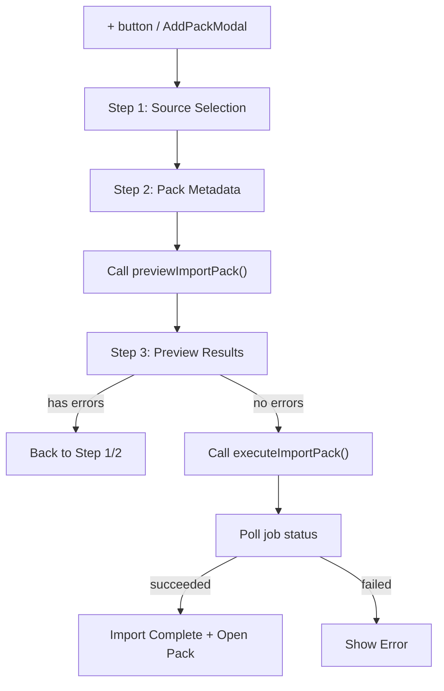

# P8 Import Pack 前端向导实施方案

## 总体设计

在现有 `AddPackModal` 的 Import Pack tab 中，实现一个三步向导，复用已有的后端 API 合同 (`importApi.previewImportPack` / `importApi.executeImportPack`) 和 Job 轮询模式 (`jobApi.getJobStatus`)。

### 交互流程



### 向导三步骤

**Step 1 — Source Selection**
- CDB 文件选择（必填）— 使用 Tauri `open()` dialog，过滤 `.cdb`
- Source Language 输入（必填）— 默认 `zh-CN`
- 自动推断：选择 CDB 后，基于其父目录自动填充以下路径（用户可清除/修改）：
  - `pics/` 目录 → `{parent}/pics`
  - `pics/field/` 目录 → `{parent}/pics/field`
  - `script/` 目录 → `{parent}/script`
  - `strings.conf` → `{parent}/strings.conf`
- 每个可选路径旁有 Browse / Clear 按钮
- "Next" 按钮进入 Step 2（CDB 和 sourceLanguage 非空时启用）

**Step 2 — Pack Metadata**
- Pack Name（必填）— 默认从 CDB 文件名推断（去掉 `.cdb` 后缀）
- Author（必填）
- Version（必填，默认 `1.0.0`）
- Description（可选）
- Display Language Order（默认填入 sourceLanguage）
- Default Export Language（可选）
- "Back" 按钮返回 Step 1，"Preview Import" 按钮触发预检

**Step 3 — Preview & Execute**
- 进入时自动调用 `importApi.previewImportPack()`，显示 loading 状态
- 预检完成后显示：
  - 统计摘要：card count / warning count / error count / missing resources
  - Issues 列表：errors 用红色，warnings 用黄色（复用 `ValidationIssue` 样式）
- 如果有 blocking errors：禁用 Import 按钮，提示需返回修改
- 如果无 errors（可有 warnings）：显示 "Import" 按钮
- 点击 Import：
  - 调用 `importApi.executeImportPack({ previewToken })`
  - 获得 `JobAcceptedDto`，启动 Job 轮询（复用 `StandardPackView` 的 TanStack Query `refetchInterval` 模式）
  - 显示进度条/阶段文字
- Job 完成后：
  - 成功：显示成功消息 + "Open Pack" 按钮，点击后调 `packApi.openPack({ packId: target_pack_id })` 并关闭 modal
  - 失败：显示错误信息 + "Back" 按钮

### Auto-fill 路径推断逻辑（纯前端）

```typescript
function inferResourcePaths(cdbPath: string) {
  const sep = cdbPath.includes("\\") ? "\\" : "/";
  const lastSep = cdbPath.lastIndexOf(sep);
  const parentDir = lastSep >= 0 ? cdbPath.substring(0, lastSep) : "";
  const fileName = cdbPath.substring(lastSep + 1);
  const baseName = fileName.replace(/\.cdb$/i, "");
  return {
    suggestedName: baseName,
    picsDir: parentDir + sep + "pics",
    fieldPicsDir: parentDir + sep + "pics" + sep + "field",
    scriptDir: parentDir + sep + "script",
    stringsConfPath: parentDir + sep + "strings.conf",
  };
}
```

## 文件变更清单

### 1. 新增文件

- **[src/features/pack/ImportPackPanel.tsx](src/features/pack/ImportPackPanel.tsx)** — 向导主组件
  - 包含 `SourceSelectionStep`、`MetadataStep`、`PreviewStep` 三个内部子组件
  - 管理向导状态（step / form / preview result / job）
  - 约 400-500 行

### 2. 修改文件

- **[src/features/pack/AddPackModal.tsx](src/features/pack/AddPackModal.tsx)**
  - 启用 Import Pack tab 按钮（移除 `disabled`）
  - 在 `importPack` 分支中渲染 `<ImportPackPanel>` 替代占位文字
  - 传入 `onPackOpened` / `onNotice` / `workspaceId` 等 props

- **[src/app/styles.css](src/app/styles.css)**
  - 新增向导步骤指示器样式（`.import-wizard-steps`）
  - 新增文件选择器行样式（`.file-picker-row`）
  - 新增预检结果样式（`.import-preview-summary`、`.import-issues-list`）
  - 新增进度条样式（`.import-job-progress`）

### 3. 不需要修改的文件

- 后端代码 — 完全不变
- `src/shared/contracts/import.ts` — 合同已就绪
- `src/shared/api/importApi.ts` — API 包装已就绪
- `src/shared/contracts/job.ts` / `jobApi.ts` — Job 合同已就绪

## 关键技术决策

1. **Job 轮询方式**：复用 `StandardPackView` 的 TanStack Query `refetchInterval` 模式（700ms），不引入 Tauri 事件监听（保持一致性，降低复杂度）
2. **路径推断**：纯前端字符串操作，不需要后端校验路径是否存在（preview 阶段会做完整校验）
3. **Import 完成后打开 pack**：使用 preview 返回的 `target_pack_id` 调 `packApi.openPack()`，然后通过 `addOpenPack` 加入侧边栏并切换为 active
4. **组件范围**：所有向导逻辑集中在 `ImportPackPanel.tsx` 一个新文件中，保持组件边界清晰

## 与 App.tsx 的集成

- `AddPackModal` 已接收 `onPackOpened` / `onNotice` 回调，`ImportPackPanel` 可直接透传使用
- 导入成功并打开 pack 后的刷新逻辑（overviews / addOpenPack）与现有 `handlePackOpened` 一致
- 需要从 shellStore 获取 `workspaceId` 传入 `PreviewImportPackInput`
